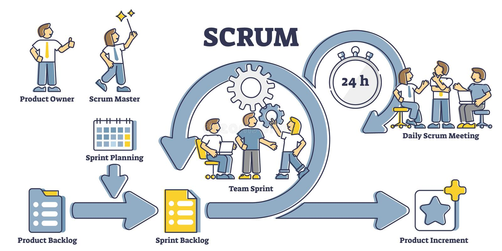
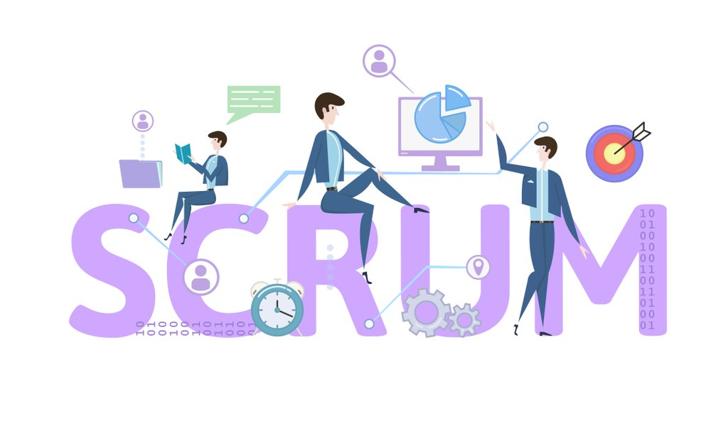

# SCRUM
 **descrição**: *Scrum é um framework de regras e um passo a passo prático para que equipes consigam desenvolver produtos conforme a metodologia ágil*
## PAPEIS DENTRO SCRUM

- **Scrum Master**: *Em linhas gerais é a figura do time que deve garantir a aplicação do framework, ou seja, precisa ser um bom conhecedor do Scrum. Ele faz isso guiando as cerimônias e verificando o cumprimento das regras, além de se responsabilizar por superar os impedimentos apontados pela equipe*. 

- **Product Owner**: *É aqui que entra uma pessoa representando o time de Produto, e eu diria que uma das figuras mais fundamentais nesse jogo. É responsabilidade do PO cuidar do product backlog, ou seja, lista de tarefas a serem desenvolvidas, refinando-o para que esteja priorizado e agregue o máximo de valor a cada entrega. Também faz a ponte com outras equipes e interessados no produto, o qual chamamos stakeholders*.

- **Desenvolvedores**: *Aqui entram todos os desenvolvedores de software, que podem ter diferentes especialidades. Podemos ter Dev Front-end, Back-end, Fullstack, QA, DevOps, Tech Leads, etc. Não há um número determinado e isso varia dependendo da empresa e do produto*.

- **PLANEJAMENTO DA SPRINT**: *MAXIMO 8 HORAS PARA TIME SCRUM META DA SPRINT*

- **REUNIÃO DIARIA**: *MAXIMO 15 MINUTOS PARA O TIME DE DESENVOLVIMENTO.*

- **REVISÃO DA SPRINT**: *MAXIMO 4 HORAS PARA O TIME SCRUM E PASTES INTERESSANDAS DEMOSTRAÇÃO DO INCREMENTO FEEDBACK 

- **RETROSPECTIVA DA SPRINT**: MAXIMA 3 HORAS PARA TIME SCRUM RELACIOMENTOS PROCESSOS FERRAMENTAS PLANO DE MELHORIA

